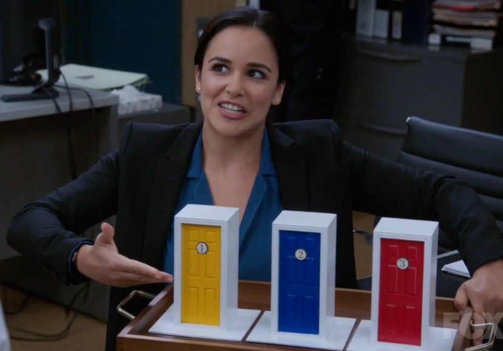

## Monty Hall problem simulation

Suppose you're on a game show, and you're given the choice of three doors: Behind one   door is a car; behind the others, goats. You pick a door, say No. 1, and the host, who   knows what's behind the doors, opens another door, say No. 3, which has a goat. He then  says to you, "Do you want to pick door No. 2?" Is it to your advantage to switch your   choice? 
  
source: [Wikipedia](https://en.wikipedia.org/wiki/Monty_Hall_problem)




Execute this simulation with ``` go run . ```
